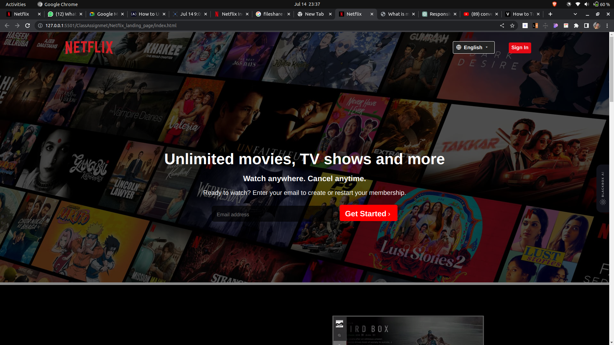
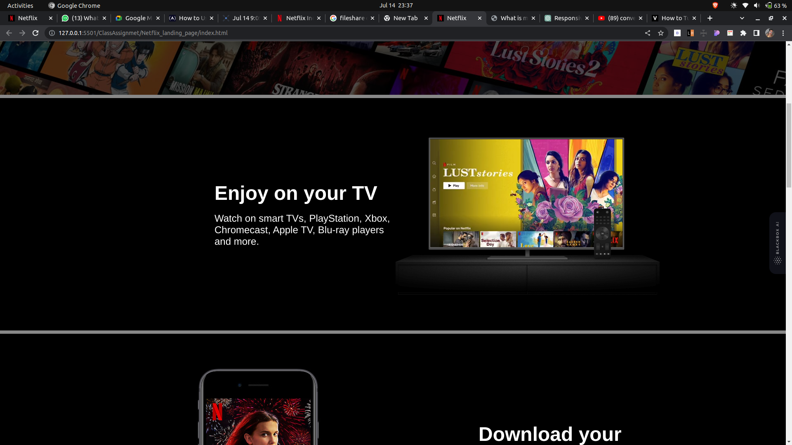
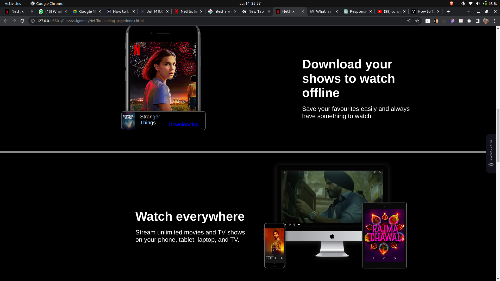
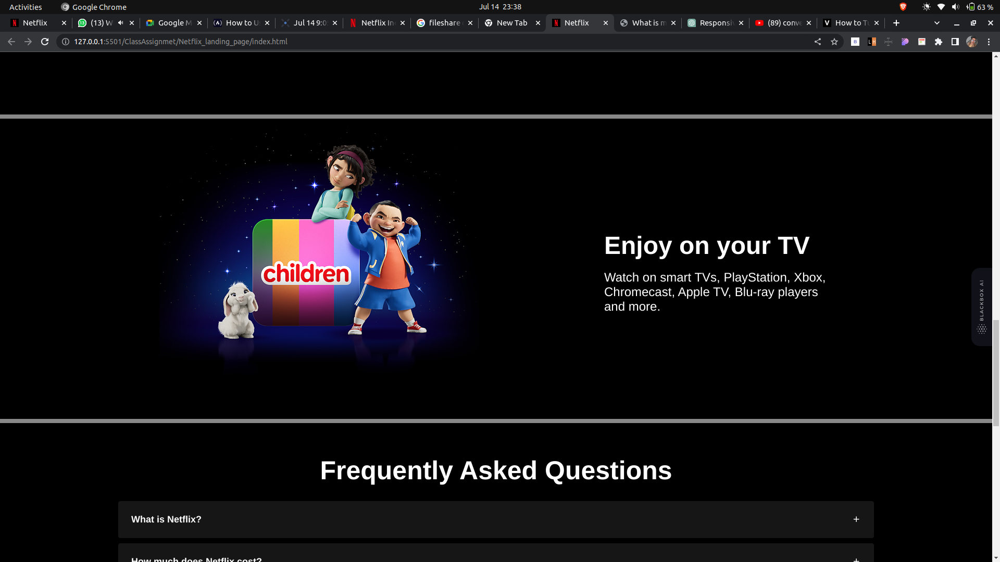
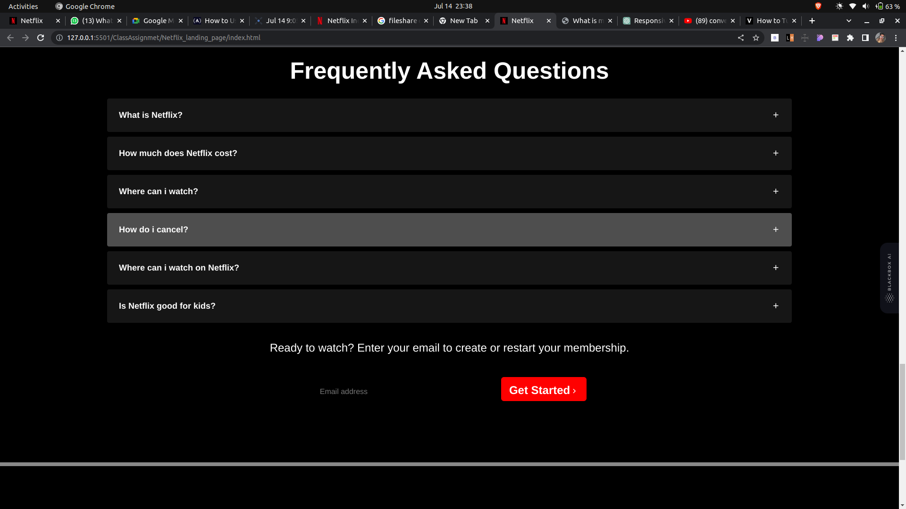
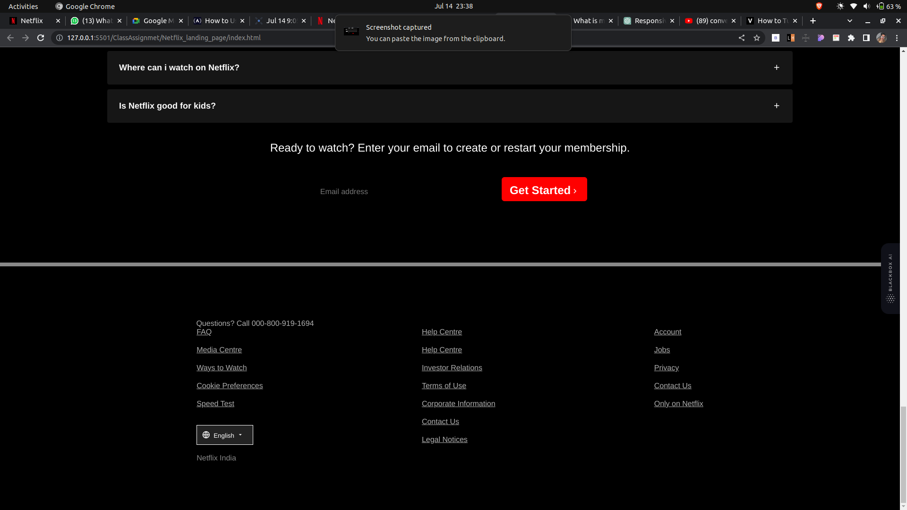

    Netflix-Clone >>>

Creating this website Using Html and Css Only. This is Only Front design for learning purpose to enhance my skill.

Hosted Link--https://asgarsidd.github.io/Geekster-Booster-Assignment/Netflix_landing_page/index.html

Uses HTML Tag : Header, Nav, Div, input, p , H1, etc..

Uses CSS Properties : Flex, background-color: rgba() for Dim light or low opacity, position (video and image fit) etc.

Screenshots->>

